# Low-fi prototype

**Version:** v1 - Cardboard Prototype
**Tools / method:** Bodystorming / role-play with cardboard props

## Purpose
If people can have fun in the moment, instead of posing for photos they know are being taken.

Will the idea of a fun activity create opportunities for candid moments?

## The concept
A laser tag game where **a camera is attached to each gun**. When a player pulls the trigger, the camera takes a photo. Players are focused on the game, not the camera, so the photos capture real, candid moments instead of posed ones.

## What we built
| Part | Made from | Represents |
| --- | --- | --- |
| Gun | Small cardboard box with a laser pointer taped on | The laser tag gun with a built-in camera. The laser dot shows where the player is aiming |
| Vest | Recycled delivery boxes worn over the shoulders | The target. Hitting the front of the vest counts as a tag |
| Photos | Phone photos taken at the moment of a "shot" | What the gun camera would capture when the trigger is pulled |

## How we tested it
Team members wore the vests and played a round of laser tag around the studio, using pillars, tables and chairs as cover. Each time someone "shot" a player's vest, a teammate took a phone photo to simulate the gun camera firing.

## Simulated trigger photos
Each photo below stands in for a picture the gun camera would take when the trigger is pulled.

| | |
| --- | --- |
| 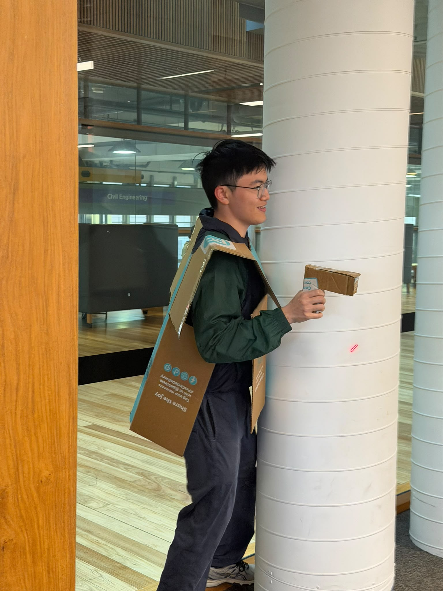 Aiming around a pillar (laser dot visible) | 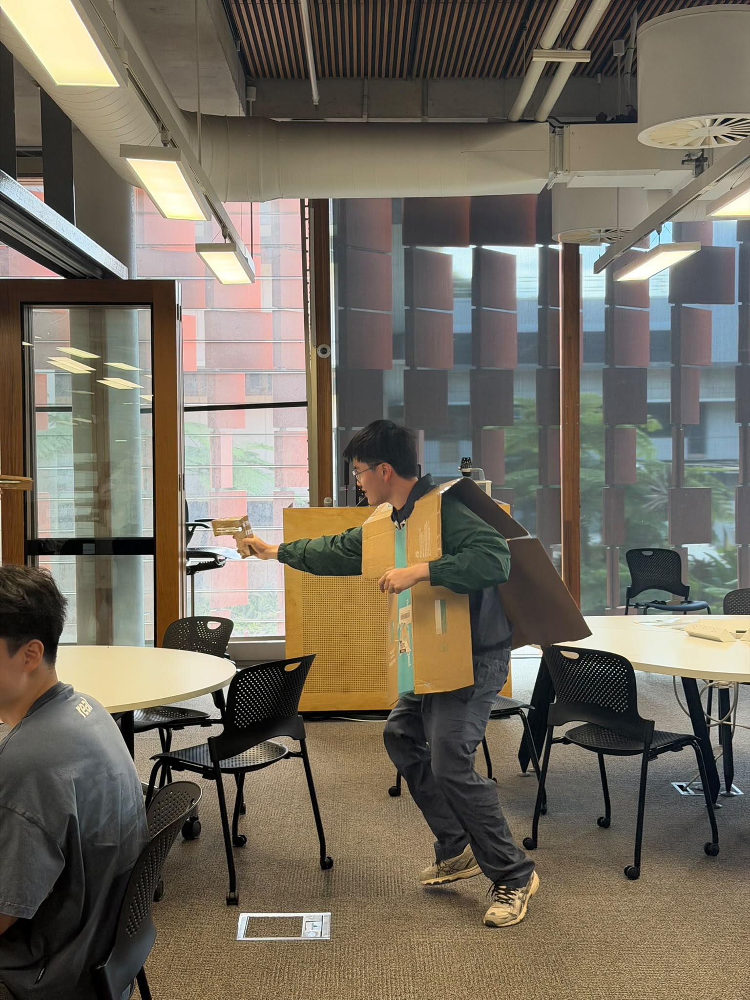 Advancing on a target |
| 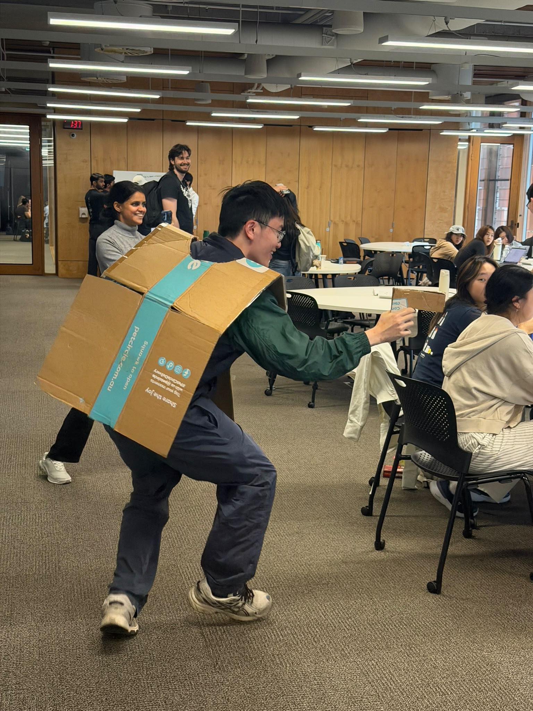 Lunging shot | 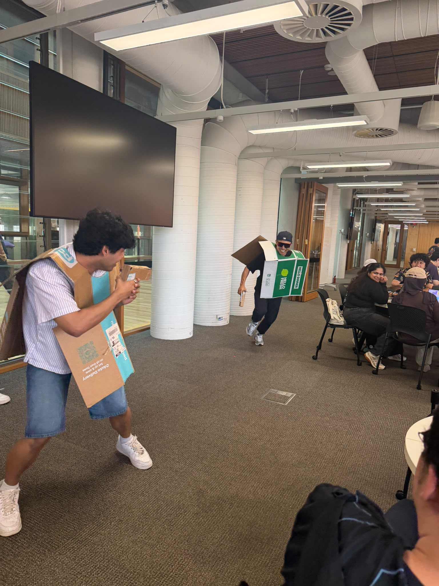 Face-off between two players |
| 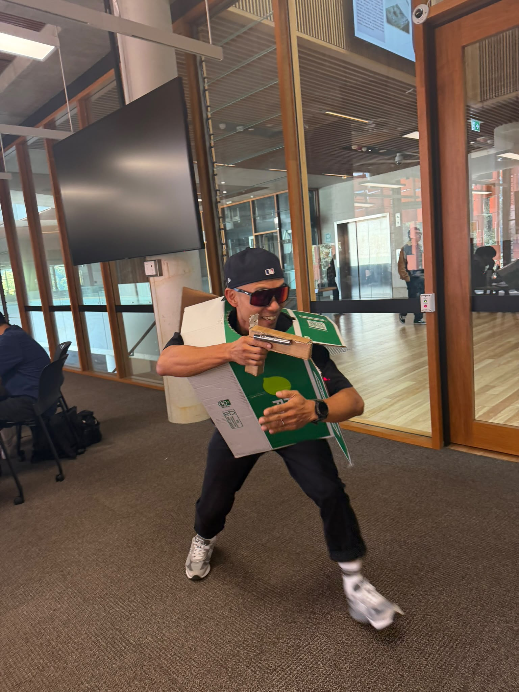 Crouched aim | 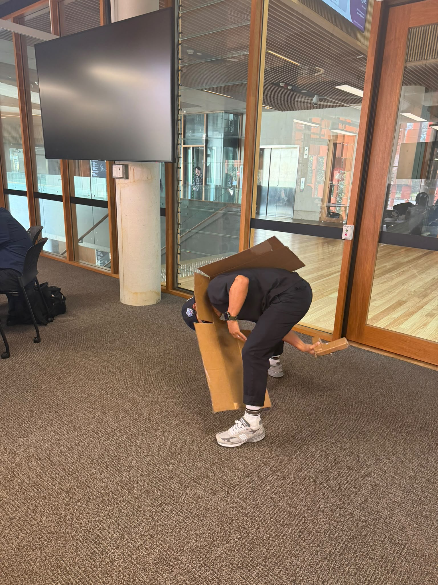 Ducking for cover |
| 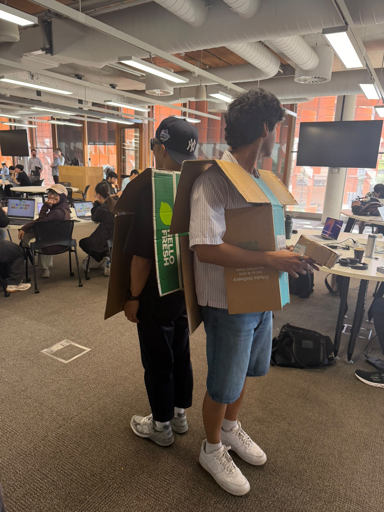 Back-to-back before a round | 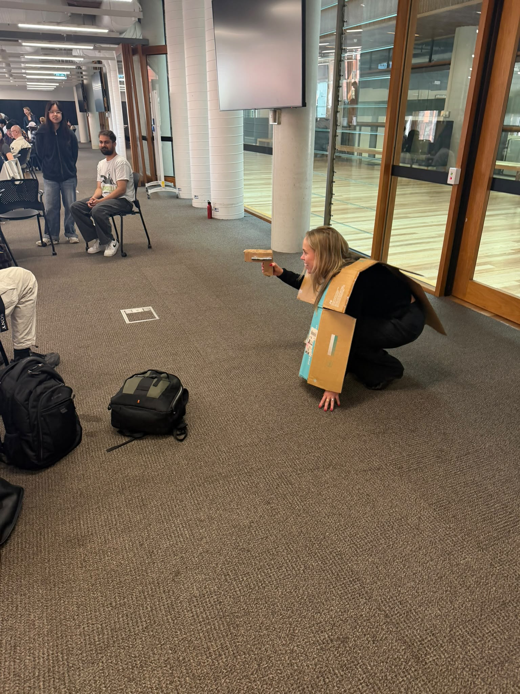 Kneeling aim |
| 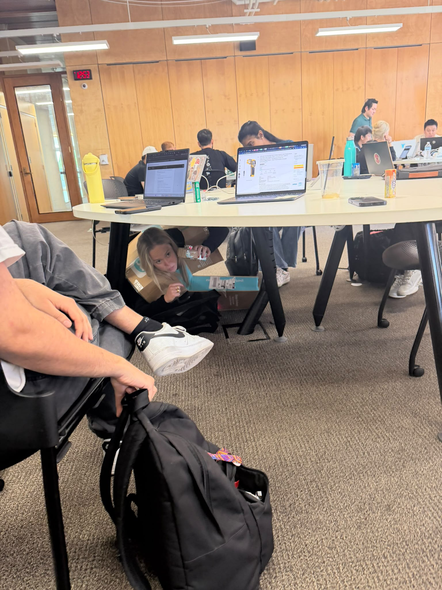 Hiding under a table | 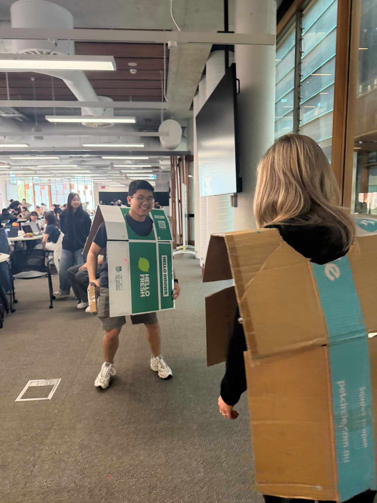 Laser hit on an opponent's vest |
| 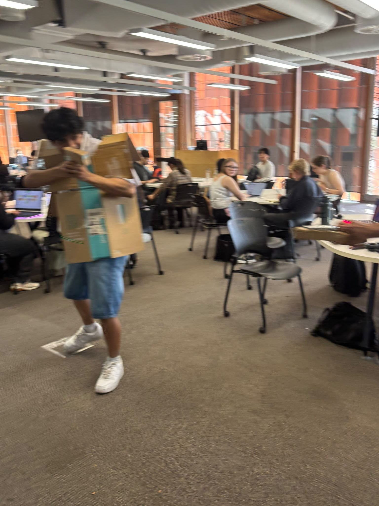 Dodging (motion blur) | 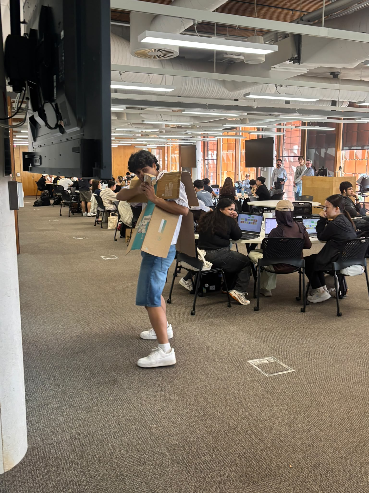 Aiming in the open |
| 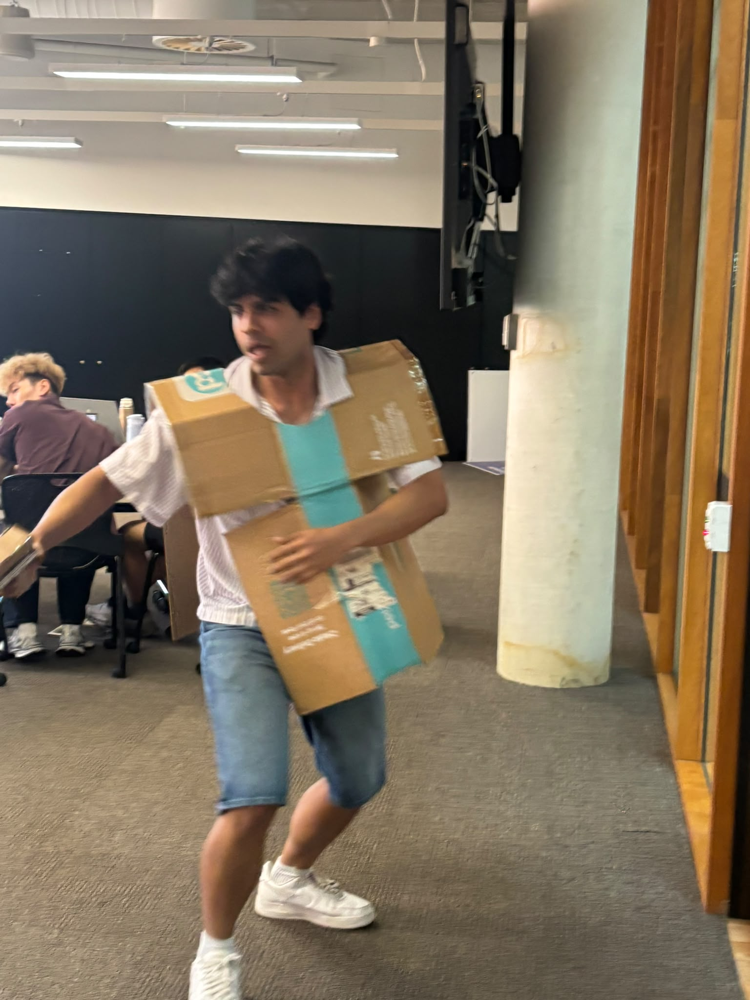 Running for cover | |

## Design decisions
| Decision | Why | Evidence (research link) |
| --- | --- | --- |
| Camera triggered by the gun, not by a person | Nobody decides when the photo is taken, so people can't pose for it | [Theme 2: Candid over Posed Photos](../../01-research/synthesis/thematic-analysis/theme2.png): "The moment I tell someone to pose, they just stop looking natural." (P10) |
| Game-based activity (laser tag) | Keeps attention on playing, not on being photographed | [Theme 2: Candid over Posed Photos](../../01-research/synthesis/thematic-analysis/theme2.png): favourite photo was one where the friend "wasn't aware I was taking the photo" (P10) |
| Laser pointer on the gun | Shows where the shot lands, so we can tell if a photo would frame the target | _add link_ |
| Vest as the target | Gives players a clear thing to aim at, which points the camera at people's bodies and faces | _add link_ |

## Observations

## Feedback / testing
**User feedback:**

### 👥 P1-2

> Loved laser tag so it was fun. Suit was cumbersome. It was fun to try to hit the small target. Couldn’t exactly aim, weren’t caring about who was winning. Wanted a time period, wanted places to hide and interact with.
>
> **Haptic feedback** would be good, a vibration? Lights? Sounds?
>
> Would prefer **countdown timer** over lives.

---

### 👥 P3-4

> **Time cop :** two guns and you had to shoot a story scenario, mission.
>
> It was fun, got to run around after a long lecture. Got pictures taken. There was a lot of familiarity in it. Concept was easy to grasp. The stage element, felt real bc  people were passively watching.
>
> There was a timer. **Timer would be more fun, more opportunity to take more photos.** It’s a fast paced game. Alternatively it’s hard to kill each other if it’s lives. Would prefer to have **feedback when getting shot** (vibration? Sound?)
>
> « The sillier the better » you know the game you’re signing up for. In this day and age a camera is in our pockets.

---

### 👥 P5-6

> It’s fun, especially when you haveosmeone running away. It’s exciting, you have to run, you have to dodge, you have to aim. Coordinate to be a player. You have to run around to be fun, obstacles and a battleground. Would love to play in a CSGO environment. The size of the classroom is enough. It’s not too big, it’s not too small.
>
> It’s fun to chase each other in a limited space. If it’s too big, people will just run. It depends on how easy it is to use the gun we design, is it easy to use, easy to aim. Small contained space. The gun is too lo-fi.
>
> **Laser trigger —> feedback for the person being shot.** Sound or vibration, it can be both.
>
> **Don’t care about looking bad in photos, the bad photos make it more fun.** The target should be the same size.
>
> **Countdown or health?** Bigger space = HP. One participant prefers 60 seconds.

## What changed next
_What we changed in the mid-fi version because of this._
